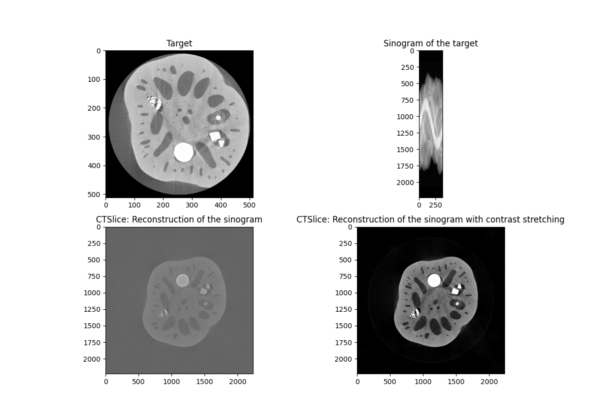

# CT Image Reconstruction

A Python implementation of CT (Computed Tomography) image reconstruction algorithms. Given a sinogram (a set of 1D projections captured at multiple angles) this project reconstructs the original 2D cross-sectional image using two classical algorithms: **Filtered Backprojection (FBP)** and **Direct Fourier Reconstruction** via the Fourier Slice Theorem.

Both parallel-beam and divergent (fan-beam) geometries are supported.

---

## Algorithms

### Filtered Backprojection (FBP)
The standard algorithm used in clinical CT scanners:
1. Apply a 1D FFT to each row of the sinogram
2. Multiply by a ramp (RAM-LAK) filter in the frequency domain
3. Apply inverse FFT back to the spatial domain
4. Backproject the filtered sinogram over a 2D grid
5. Apply a Hamming window for smoothing

### Direct Fourier Reconstruction (Fourier Slice Theorem)
An alternative frequency-domain approach:
1. Compute the 1D FFT of each sinogram row
2. Place the results onto a 2D polar frequency grid
3. Interpolate onto a Cartesian frequency grid
4. Apply an inverse 2D FFT to recover the image

### Fan-Beam Rebinning
Divergent (fan-beam) sinograms are rebinned to equivalent parallel-beam sinograms before reconstruction, using bilinear 2D interpolation and the scanner's geometry parameters (FOD, FDD, sensor width).

---

## Results



The figure above shows a full reconstruction pipeline on a real CT cross-section:
- **Top left** — original target image
- **Top right** — input sinogram (parallel-beam projections)
- **Bottom left** — Direct Fourier reconstruction (raw output)
- **Bottom right** — same reconstruction after contrast stretching

The Shepp-Logan phantom — the standard test object in CT imaging — is also included for validation.

---

## Installation

**Requirements:** Python 3.8+

```bash
git clone https://github.com/your-username/CT-Image-Reconstruction.git
cd CT-Image-Reconstruction
pip install -r requirements.txt
```

---

## Usage

### Run the main script

```bash
python main.py --mode <mode>
```

| Mode | Description |
|------|-------------|
| `fourier` | Direct Fourier Reconstruction (Fourier Slice Theorem) |
| `fbp` | Filtered Backprojection with ramp filter |
| `rebin` | Rebin divergent (fan-beam) sinogram to parallel-beam |
| `sinogram` | Generate a sinogram from the Shepp-Logan phantom |
| `detect` | Detect 180° vs 360° sinogram coverage |
| `ramlak` | Filtered Backprojection with RAM-LAK filter |

### Run the cleaned, CLI-ready version

```bash
python FourierSliceTheorem_cleaned.py --target Samples/lotus.png --sinogram Samples/lotus_parallel.png
```

| Argument | Default | Description |
|----------|---------|-------------|
| `--target` | `Samples/lotus.png` | Path to the ground-truth image |
| `--sinogram` | `Samples/lotus_parallel.png` | Path to the input sinogram |

---

## Project Structure

```
CT-Image-Reconstruction/
├── main.py                          # Main entry point (flag-based execution)
├── FourierSliceTheorem_cleaned.py   # Production-ready CLI version
├── BasicFST.py                      # Minimal Fourier Slice Theorem demo
├── requirements.txt
├── Samples/                         # Sample images and sinograms for testing
│   ├── lotus.png
│   ├── lotus_parallel.png
│   ├── lotus_divergent.png
│   ├── Shepp_Logan.png
│   ├── Shepp_Logan_Sino.png
│   └── cirkel.png
└── Data/
    ├── Parallel Projection/         # Additional parallel-beam test sinograms
    └── Divergent Projection/        # Fan-beam sinograms and raw .mat data
```

---

## Dependencies

| Library | Purpose |
|---------|---------|
| `numpy` | Array operations and FFT |
| `scipy` | Advanced FFT, interpolation, image transforms |
| `opencv-python` | Image I/O and preprocessing |
| `scikit-image` | Image rotation and resizing |
| `matplotlib` | Visualization and result plots |
| `Pillow` | Supplementary image I/O |

---

## Author

**Devon Vanaenrode**
